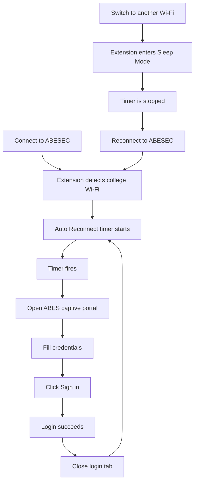
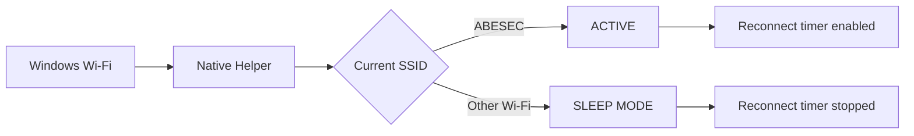
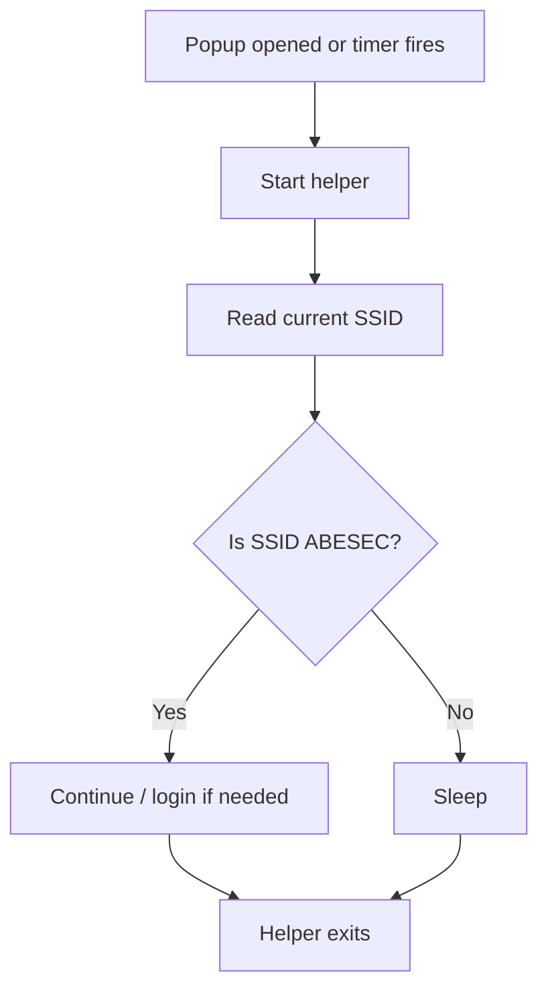
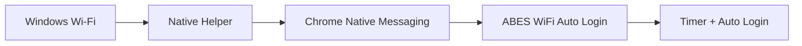
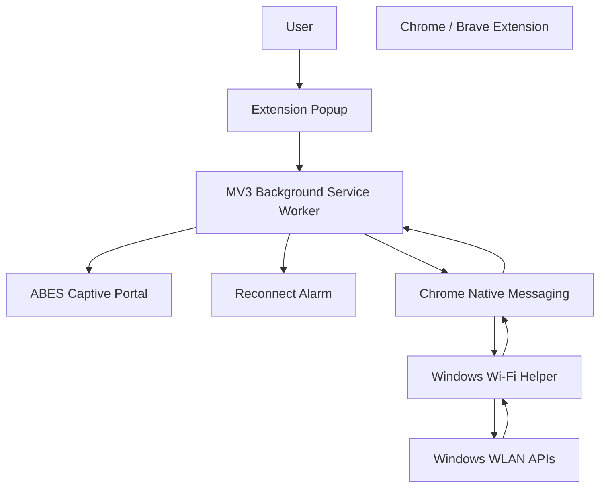

# ABES WiFi Auto Login

> Automatically re-login to the ABES-EC college Wi-Fi captive portal without manually entering your credentials every 1–2 hours.


## Why does this exist?

At ABES Engineering College, the Wi-Fi connection can require you to authenticate again after a limited session.

The usual workflow looks like this:

```text
Connect to ABESEC
       ↓
Use internet
       ↓
Session expires
       ↓
Open college login page
       ↓
Enter username + password
       ↓
Click "Sign in"
       ↓
Internet works again
```

Doing this manually every time is annoying, especially during classes, coding sessions, labs, or study hours.

**ABES WiFi Auto Login** automates that repetitive process.

---

## What it does

Once configured, the extension can:

- Automatically open the ABES captive portal in a background tab.
- Fill in your username and password.
- Click **Sign in**.
- Detect successful authentication.
- Close the login tab automatically.
- Reconnect on a user-defined schedule.
- Pause automatic login when you are connected to another Wi-Fi network.
- Resume the timer when you reconnect to the configured college Wi-Fi.
- Support two detection modes:
  - **Real-Time:** reacts to Wi-Fi changes using a lightweight native helper.
  - **Battery Saver:** checks the Wi-Fi only when the popup or reconnect timer needs it.
- Refresh the displayed Wi-Fi status when the extension popup is opened.

### In simple terms



---

# Features

| Feature | V4.2 |
|---|:---:|
| Automatic portal login | ✅ |
| Background login tab | ✅ |
| Automatic tab cleanup | ✅ |
| Configurable reconnect interval | ✅ |
| Real-Time Wi-Fi detection | ✅ |
| Battery Saver Wi-Fi detection | ✅ |
| Sleep mode on other Wi-Fi | ✅ |
| Automatic resume on ABESEC | ✅ |
| Fresh status when popup opens | ✅ |
| ABES-specific default setup | ✅ |
| Windows native helper | ✅ |

---

# Requirements

You need:

- **Windows 10 or Windows 11**
- **Google Chrome or Brave**
- Access to the **ABESEC** Wi-Fi network
- A college Wi-Fi account that can authenticate through the ABES portal
- Internet access to download the project and Go during setup

The current project is **Windows-specific** because the Wi-Fi detection helper uses Windows WLAN APIs.

---

# Installation

## Recommended method

The repository contains the Chrome/Brave extension source and the Windows native helper source.

The native helper is built **locally on your computer** from `main.go`.

This means you do not need to download a precompiled helper executable from the project.

### 1. Download the repository

On GitHub:

**Code → Download ZIP**

Extract it somewhere permanent.

For example:

```text
D:\ABES WiFi Login\ABES-WiFi-AutoLogin
```

Do not repeatedly move the folder after installation.

---

### 2. Check the project structure

You should have:

```text
ABES-WiFi-AutoLogin/
│
├── extension/
│   ├── manifest.json
│   ├── background.js
│   ├── content.js
│   ├── popup.html
│   ├── popup.js
│   └── popup.css
│
├── native-host/
│   ├── main.go
│   └── go.mod
│
├── install.bat
├── uninstall.bat
├── .gitignore
└── README.md
```

You may see `abes-wifi-helper.exe` after building the helper. That file is generated locally and is intentionally ignored by Git.

---

### 3. Run the installer

Double-click:

```text
install.bat
```

The installer will:

1. Check whether the native helper already exists.
2. If it does not exist, check whether Go is installed.
3. Install Go through **Windows Package Manager (`winget`)** when available.
4. Build the helper from `native-host\main.go`.
5. Copy the helper to the local application directory.
6. Register the Chrome/Brave Native Messaging host.
7. Verify the installation.
8. Tell you where to load the extension.

You should see a successful completion message before continuing.

> **If `winget` is unavailable**, install Go from the official Go website and run `install.bat` again.

---

### 4. Load the extension in Brave

Open:

```text
brave://extensions/
```

Turn on:

**Developer mode**

Then click:

**Load unpacked**

Select:

```text
ABES-WiFi-AutoLogin/extension
```

### For Google Chrome

Open:

```text
chrome://extensions/
```

The same **Load unpacked** process applies.

---

### 5. Configure the extension

Open the extension popup.

You will see options such as:

```text
College Wi-Fi SSID
[ ABESEC ]

Detection Mode
○ Real-Time
○ Battery Saver

Username
[ your username ]

Password
[ your password ]

Auto Reconnect
[ ON / OFF ]

Reconnect every
[ value ] [ Minutes / Hours ]
```

Enter your own college credentials.

**Never share your username or password with the project author or anyone else.**

---

# Choosing a detection mode

## Real-Time Mode

Use this when you want the extension to react immediately to Wi-Fi changes.



The helper waits for Windows WLAN events instead of repeatedly requesting a website.

### Best for

- Desktop PCs
- Higher-end laptops
- Users who want immediate Wi-Fi state changes

### Resource behavior

The native helper remains available so it can react to Wi-Fi events. It is **event-driven**, not a constant website/network polling loop.

---

## Battery Saver Mode

Use this when you prefer not to keep the native helper running continuously.



### Best for

- Battery-powered laptops
- Lower-end devices
- Users who want the lowest background resource usage

---

# Auto Reconnect

You can choose how often the extension should attempt a reconnect check.

For example:

```text
30 minutes
1 hour
1 hour 30 minutes
2 hours
3 hours
```

You can also enter a custom value.

### Important behavior

The timer is only active while the configured college Wi-Fi is connected.

```text
ABESEC
  ↓
Timer ACTIVE

Home Wi-Fi
  ↓
Timer STOPPED / Sleep Mode

ABESEC again
  ↓
Timer STARTS again
```

This prevents the extension from trying to open the ABES login portal while you are at home or connected to some other network.

---

# Connect Now

**Connect Now** performs an immediate login attempt.

It is useful when:

- Your session has just expired.
- You do not want to wait for the scheduled timer.
- You are testing the setup.

The login flow runs in a background tab.

```text
Connect Now
    ↓
ABES Portal
    ↓
Fill username
    ↓
Fill password
    ↓
Sign in
    ↓
Authentication successful
    ↓
Close login tab
```

---

# Privacy and security

This project is designed so that each student uses **their own credentials on their own device**.

### Credentials

Your username and password are handled locally by the extension.

They are not sent to the project repository or to the project author.

**Never commit your credentials to GitHub.**

### Native helper

The native Windows helper is used for Wi-Fi detection.

Its job is to:

- Read the currently connected Wi-Fi SSID.
- Communicate that information to the extension through Chrome Native Messaging.

The native helper does **not** need your ABES portal username or password.

### What the project does not need

The project does not need:

- A cloud database
- Firebase
- A backend server
- Your GitHub account
- Your ABES password sent to the developer

---

# Why is there a Windows native helper?

Chrome extensions cannot directly use the normal Windows Wi-Fi APIs to read the current Wi-Fi SSID.

The project therefore uses:



The helper is a small Windows component that bridges the gap between Windows networking information and the browser extension.

---

# Troubleshooting

## "Specified native messaging host not found"

This usually means the native helper was not registered correctly.

Try:

1. Close Chrome/Brave.
2. Run `install.bat` again.
3. Make sure the helper was built successfully.
4. Reopen the browser.
5. Reload the extension.

If the installer reports an error, **keep the terminal window open and read the error message**.

---

## The extension says Wi-Fi is not detected

Check:

```text
Current Wi-Fi SSID
```

Make sure it exactly matches:

```text
ABESEC
```

SSID matching is case-sensitive in the current configuration.

---

## Auto reconnect does not run

Check all three:

```text
Auto Reconnect = ON
```

```text
Current Wi-Fi = ABESEC
```

```text
Reconnect interval = valid value
```

When you leave `ABESEC`, the timer intentionally stops.

---

## Login works manually but not automatically

Open the ABES portal manually and verify that:

```text
Username field
Password field
Sign in
```

still behave normally.

The extension currently targets the ABES portal at:

```text
https://192.168.1.254:8090/
```

If ABES changes the portal's page structure or login mechanism, the extension may need an update.

---

# Uninstall

If you want to remove the Windows native helper, run:

```text
uninstall.bat
```

Then remove the extension from:

```text
brave://extensions/
```

or:

```text
chrome://extensions/
```

---

# Project architecture



---

# Project structure

```text
ABES-WiFi-AutoLogin/
│
├── extension/
│   ├── manifest.json      # Chrome extension configuration
│   ├── background.js      # Timers, Wi-Fi state, tabs, Native Messaging
│   ├── content.js         # Portal login automation
│   ├── popup.html         # Extension UI
│   ├── popup.js           # Popup logic
│   └── popup.css          # Popup styling
│
├── native-host/
│   ├── main.go            # Windows Wi-Fi / Native Messaging helper
│   └── go.mod             # Go module definition
│
├── install.bat            # Build + install helper + register Native Messaging
├── uninstall.bat          # Remove Native Messaging registration/helper
├── .gitignore             # Ignores generated binaries and local files
└── README.md              # Project documentation
```

---

# Open-source project

This project is intended as a practical campus utility and an open-source learning project.

It was built around a real problem:

> **Having to manually re-authenticate to college Wi-Fi every 1–2 hours.**

The goal is to make that repetitive process automatic while keeping the setup local and transparent.

---

# Important notes

### ABES-specific

This release is intentionally **ABES-specific**.

The default captive portal is:

```text
https://192.168.1.254:8090/
```

and the expected college Wi-Fi SSID is:

```text
ABESEC
```

A future version may support other colleges and captive portals, but that is not the goal of V4.2.

### Beta status

V4.2 is the stable version currently being shared for testing among ABES students.

It works with the tested ABES setup, but different Windows systems, browser versions, antivirus products, or future portal changes may behave differently.

---

# Contributing

Found a bug?

You can:

1. Open a GitHub Issue.
2. Describe your Windows version.
3. Mention whether you use Chrome or Brave.
4. Mention whether you use Real-Time or Battery Saver mode.
5. Include the exact error message.

**Never include your Wi-Fi username, password, or other private credentials in an issue.**

Pull requests are welcome.

---

# License

MIT License

See [`LICENSE`](LICENSE) for details.

---

## Made for ABES students

Built to remove one small but extremely annoying part of the college experience:

**"Why do I have to log into Wi-Fi again?"**
