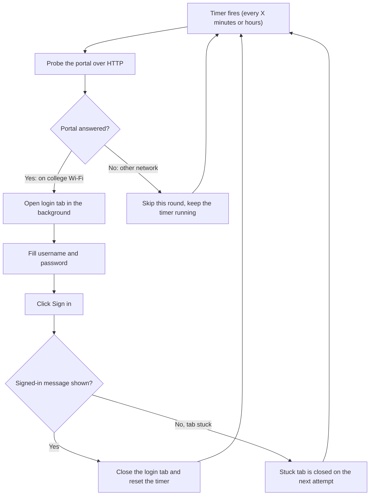
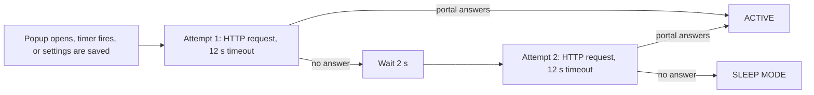
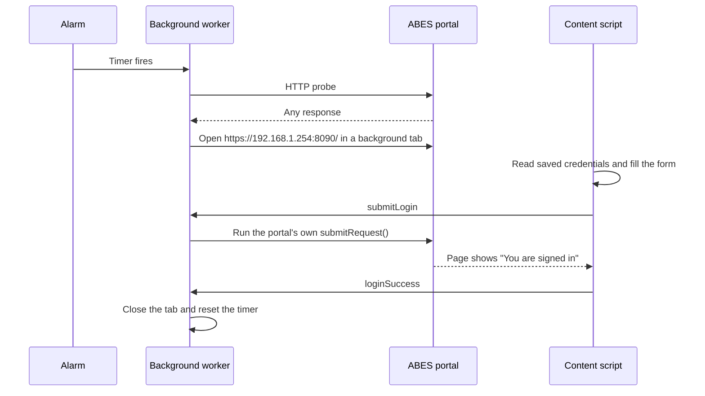
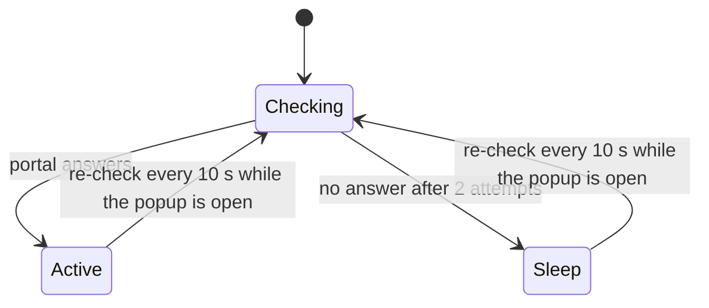
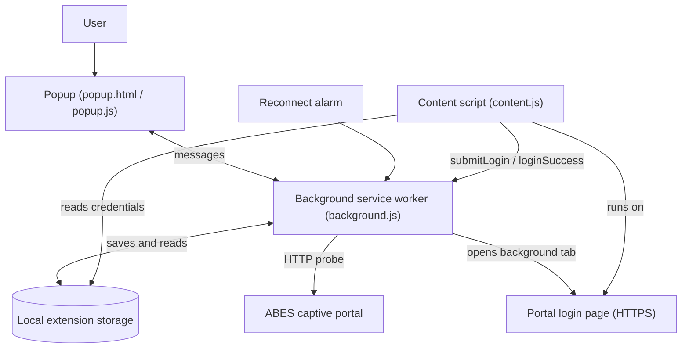

# ABES WiFi Auto Login

> Automatically re-login to the ABES-EC college Wi-Fi captive portal, so you never have to type your credentials again every 1–2 hours.


**v4.3.0 is a browser-only extension.** There is no `install.bat`, no Go, no helper `.exe`, and nothing to build. Download the ZIP, load it in your browser, enter your credentials, done.

---

## Table of contents

- [Why does this exist?](#why-does-this-exist)
- [What it does](#what-it-does)
- [How it works](#how-it-works)
- [What's new in v4.3.0](#whats-new-in-v430)
- [Requirements](#requirements)
- [Installation](#installation)
- [Using the extension](#using-the-extension)
- [Updating](#updating)
- [Upgrading from v4.2](#upgrading-from-v42)
- [Privacy and security](#privacy-and-security)
- [Troubleshooting](#troubleshooting)
- [Project structure](#project-structure)
- [Technical details](#technical-details)
- [Known limitations](#known-limitations)
- [Contributing](#contributing)
- [License](#license)

---

## Why does this exist?

At ABES Engineering College, the Wi-Fi asks you to authenticate again after a limited session. The usual routine looks like this:

```text
Connect to ABESEC
       ↓
Use the internet
       ↓
Session expires
       ↓
Open the college login page
       ↓
Enter username + password
       ↓
Click "Sign in"
       ↓
Internet works again
```

Doing this by hand every time is annoying, especially during classes, labs, coding sessions and study hours. **ABES WiFi Auto Login** does that repetitive part for you.

---

## What it does

Once configured, the extension:

- Opens the ABES captive portal in a **background tab**.
- Fills in your username and password and clicks **Sign in**.
- Detects the successful login and **closes the tab** automatically.
- Repeats the login on a **schedule you choose** (for example every 2 hours).
- **Sleeps automatically** when you are on another network (home Wi-Fi, mobile hotspot) and **resumes by itself** once you are back on the college Wi-Fi.
- Shows live status in the popup: checking, active, or sleep mode.
- Has a **Connect Now** button for an immediate login.

---

## How it works

### The big picture



### How the extension knows you are on the college Wi-Fi

Earlier versions asked Windows for the Wi-Fi name through a native helper. v4.3.0 does not need that. It simply asks: **"Can I reach the ABES login portal?"**



The portal can be slow to respond, so the extension **never concludes "not on college Wi-Fi" from a single failed attempt**. It only goes to sleep mode after every attempt has failed.

The request carries no username or password, and the extension does not read the portal's reply. It only checks that a reply came back.

### What happens during a login



### Popup status



While the popup is open it re-checks every 10 seconds and also reacts immediately when your browser goes online or offline. When the popup is closed, nothing polls in the background. The only background activity is the reconnect timer you configured.

---

## What's new in v4.3.0

| | v4.2 | v4.3.0 |
|---|---|---|
| Installer (`install.bat`) | Required | **Not needed** |
| Go toolchain | Required | **Not needed** |
| Windows native helper (`.exe`) | Required | **Not needed** |
| Windows Defender / Smart App Control blocks | Common on other laptops | **Gone** (nothing to block) |
| Install steps | 8+ | **Download, extract, Load unpacked** |
| Operating systems | Windows only | **Windows, macOS, Linux** (see [Requirements](#requirements)) |
| Wi-Fi detection | Windows WLAN events | **Portal reachability check** |
| Real-Time / Battery Saver modes | Yes | **Removed** (no longer needed) |
| Timer away from college Wi-Fi | Stopped | **Keeps running, skips the round, resumes automatically** |
| Stuck login tab | Could block later logins | **Closed automatically after 90 s** |
| Popup status | Updated when opened | **Also refreshes by itself while open** |
| Popup design | Basic | **Refreshed** |

---

## Requirements

- A **Chromium-based browser**: Google Chrome or Brave (both tested), or Microsoft Edge and other Chromium browsers (should work).
- Access to the **ABESEC** Wi-Fi network.
- A college Wi-Fi account that can sign in through the ABES portal.

| Operating system | Status |
|---|---|
| Windows 10 / 11 | Tested |
| macOS | Tested |
| Linux | Tested |

Firefox and Safari are **not supported**.

---

## Installation

### 1. Download the extension

Go to the [**Releases** page](https://github.com/harshsingh2275/ABES-WiFi-AutoLogin/releases) and download **`ABES-WiFi-AutoLogin-v4.3.0.zip`** from the latest release.

> Use the ZIP attached to the release. You do not need the repository's "Download ZIP" button.

### 2. Extract it to a permanent folder

Extract the ZIP somewhere it can stay, for example:

```text
D:\ABES WiFi Login\extension
```

The extracted folder must directly contain `manifest.json`:

```text
extension/
├── manifest.json
├── background.js
├── content.js
├── popup.html
├── popup.js
└── popup.css
```

> **Do not move or rename this folder after installing.** Browsers tie an unpacked extension to its folder location. Moving it makes the browser treat it as a new extension and your saved settings are lost.

### 3. Load it in your browser

| Browser | Extensions page |
|---|---|
| Brave | `brave://extensions/` |
| Chrome | `chrome://extensions/` |
| Edge | `edge://extensions/` |

1. Turn on **Developer mode** (top right).
2. Click **Load unpacked**.
3. Select the folder that contains `manifest.json`.

The extension should now appear in your list. Pin it from the puzzle-piece icon so it is one click away.

### 4. Configure it

Open the popup, enter your **username** and **password**, and click **Save Settings**. That is all.

---

## Using the extension

### Popup fields

| Field | What it does |
|---|---|
| **College Wi-Fi SSID** | The network name shown in the status bar (default `ABESEC`). In this version it is **informational only** and does not affect detection. Leave it as `ABESEC`. |
| **Username** | Your college Wi-Fi username. |
| **Password** | Your college Wi-Fi password. |
| **Auto Reconnect** | Turns the scheduled re-login on or off. |
| **Reconnect every** | How often to log in again, in minutes or hours. The default is 2 hours. |
| **Save Settings** | Saves everything and re-checks the network. |
| **Connect Now** | Starts a login immediately, in a background tab. |

### Status bar

| What you see | Meaning |
|---|---|
| `Checking college network...` | The extension is testing whether the portal can be reached. This can take a few seconds, longer if the portal is slow or you are on another network. |
| `ABESEC detected • ACTIVE` | The portal answered, so you are on the college Wi-Fi. Logins will run. |
| `College Wi-Fi not detected • SLEEP MODE` | The portal did not answer. Automatic logins are skipped until you are back on the college Wi-Fi. |

### Auto Reconnect

```text
At college (ABESEC)        →  timer fires  →  portal answers  →  login runs
At home / other network    →  timer fires  →  no answer        →  round skipped
Back at college            →  next timer fire  →  login runs again, automatically
```

- The timer keeps running while Auto Reconnect is on. Away from college it does nothing, so no random tabs open.
- After you switch Auto Reconnect on, the **first automatic login happens after one full interval**. Press **Connect Now** if you want to log in right away.
- If you are already signed in when the timer fires, the portal simply confirms it. Nothing breaks.

### Connect Now

Use it when your session has just expired, when you do not want to wait for the timer, or while testing your setup. If the college Wi-Fi is not reachable, the popup tells you that automatic login is sleeping.

---

## Updating

Future versions will be published on the Releases page.

1. Download the new ZIP.
2. **Extract it over the same folder**, replacing the old files.
3. Open the extensions page and click the **reload** icon (🔄) on the extension card.

Extracting into a *different* folder creates a new extension in the browser's eyes, and you would need to enter your credentials again.

---

## Privacy and security

This project is built so each student uses **their own credentials on their own device**.

- **Where your credentials live:** your username and password are saved in the browser's local extension storage (`chrome.storage.local`) on your own computer. They are **not encrypted** at rest, so anyone who can open your browser profile on your device could read them. Use the extension on **your personal device and profile only**, and never on a shared computer.
- **Where they are sent:** only to the official ABES portal, when the extension fills in its login form. They are never sent to the author, to GitHub, or to any other server.
- **The network check:** it is a plain HTTP request to the portal's address. It contains **no credentials**, and the extension does not read the response.
- **No backend:** no cloud database, no analytics, no accounts, no tracking.
- **Never commit credentials to GitHub**, and never paste them into an issue.

### Permissions explained

| Permission | Why it is needed |
|---|---|
| `storage` | Save your settings locally. |
| `alarms` | Run the reconnect timer. |
| `tabs` | Open and close the background login tab, and notice when the portal sends the tab to the college website after login. |
| `scripting` | Trigger the portal's own login function on the portal page. |
| `https://192.168.1.254:8090/*` | Run the login automation on the ABES portal page only. |
| `https://www.abes.ac.in/*` | Recognise the college website that opens after a successful login, so the login tab can be closed. |

---

## Troubleshooting

### The status says SLEEP MODE even though I am on ABESEC

- Make sure the laptop is really connected to **ABESEC**, not a hotspot or a wired network.
- Open `http://192.168.1.254:8090/` in a normal browser tab. If it does not respond, the portal itself is unreachable at that moment.
- Reload the extension from the extensions page and open the popup again.

### The status stays on "Checking college network..." for a long time

Away from the college Wi-Fi, the extension waits for two attempts of up to 12 seconds each before giving up, so it can take up to about 25 seconds to show **SLEEP MODE**. This is deliberate: the portal is sometimes slow, and a single failure should not be treated as "not on college Wi-Fi".

### Login works manually but not automatically

1. Open `https://192.168.1.254:8090/` yourself and confirm the username field, the password field and **Sign in** all work.
2. Check that **Username** and **Password** are saved in the popup (click **Save Settings**).
3. Press **Connect Now** and watch whether a background tab opens.
4. If ABES changes the portal's page, the extension may need an update. Please open an issue.

### The portal tab shows "Your connection is not private"

This warning comes from the portal's own HTTPS page, not from the extension. If it appears in the background login tab, the extension cannot continue on that page. A stuck login tab is **closed automatically after 90 seconds**, and the next scheduled attempt starts fresh, so it no longer blocks future logins. You can also press **Connect Now** again.

### Auto Reconnect does not seem to run

Check that:

- **Auto Reconnect** is switched on and you pressed **Save Settings**.
- **Reconnect every** has a valid value (at least 1 minute).
- You are on the college Wi-Fi when the timer fires (otherwise that round is skipped on purpose).
- The popup line "Next login check" shows a future time.

### "Could not load manifest" or "Could not load javascript 'content.js'"

One of the extension's files is missing from the folder you selected. The folder must directly contain all six files listed in [Installation](#installation). Extract the release ZIP again and select the folder that contains `manifest.json`.

### Old errors in the extension's Errors page

The browser keeps old errors until you click **Clear all**. After clearing them, use the extension again and check whether new ones appear.

### Uninstall

Remove the extension from your browser's extensions page. v4.3.0 installs nothing else on your computer.

---

## Project structure

```text
ABES-WiFi-AutoLogin/
│
├── extension/
│   ├── manifest.json      # Extension configuration and permissions
│   ├── background.js      # Reconnect timer, network check, login tab handling
│   ├── content.js         # Fills the portal form and detects a successful login
│   ├── popup.html         # Popup layout
│   ├── popup.js           # Popup logic and live status
│   └── popup.css          # Popup styling
│
├── LICENSE                # MIT License
└── README.md              # This file
```

### Architecture



---

## Technical details

| Setting | Value |
|---|---|
| Extension type | Manifest V3 |
| Portal login URL | `https://192.168.1.254:8090/` |
| Network check URL | `http://192.168.1.254:8090/` |
| Network check timeout | 12 seconds per attempt |
| Attempts before sleep mode | 2 (2 seconds apart) |
| Result reuse window | 5 seconds |
| Popup auto re-check | Every 10 seconds, only while the popup is open |
| Stuck login tab cleanup | After 90 seconds |
| Default reconnect interval | 2 hours (minimum 1 minute) |

---

## Known limitations

- **ABES-specific.** The portal address is built in. Other colleges would need code changes.
- **Credentials are stored unencrypted** in the browser profile (see [Privacy and security](#privacy-and-security)).
- **Detection is based on reachability**, not on the Wi-Fi name. A different network that happens to answer on `192.168.1.254:8090` would also count as the college network.
- **The Wi-Fi SSID field is informational** in this version.
- **Chromium browsers only.**
- **macOS and Linux are untested.** Reports are welcome.
- If ABES changes its portal, the extension may need an update.

---

## Contributing

Found a bug or tested it on macOS or Linux? Please open a GitHub Issue and include:

1. Your operating system and version.
2. Your browser (Chrome, Brave, Edge) and version.
3. The extension version (shown on the extensions page).
4. What you expected and what happened, plus the exact error text.

**Never include your username, password or any other private credential in an issue.**

Pull requests are welcome.

---

## License

MIT License. See [`LICENSE`](LICENSE) for details.

---

## Made for ABES students

Built to remove one small but extremely annoying part of the college experience:

**"Why do I have to log into Wi-Fi again?"**
